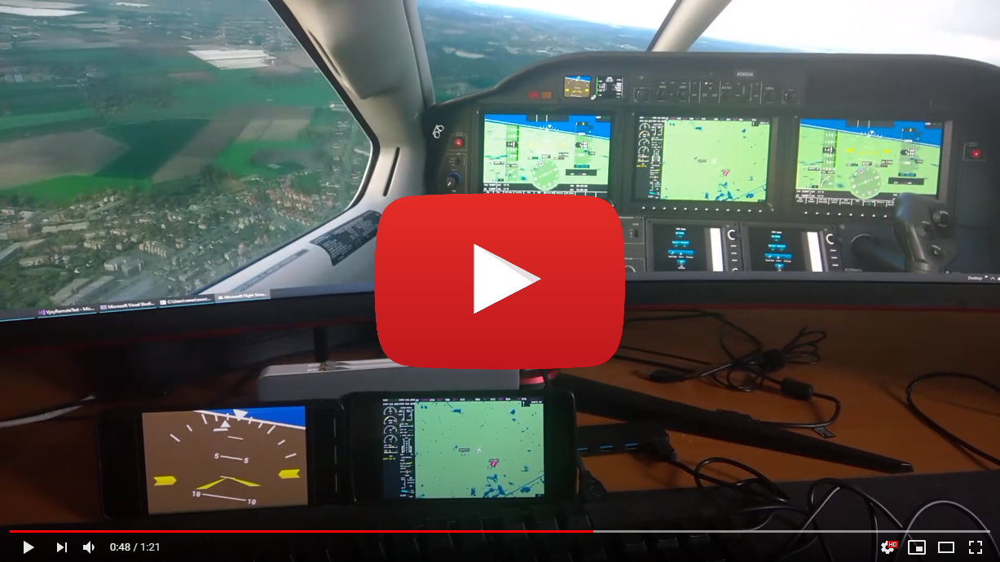
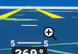
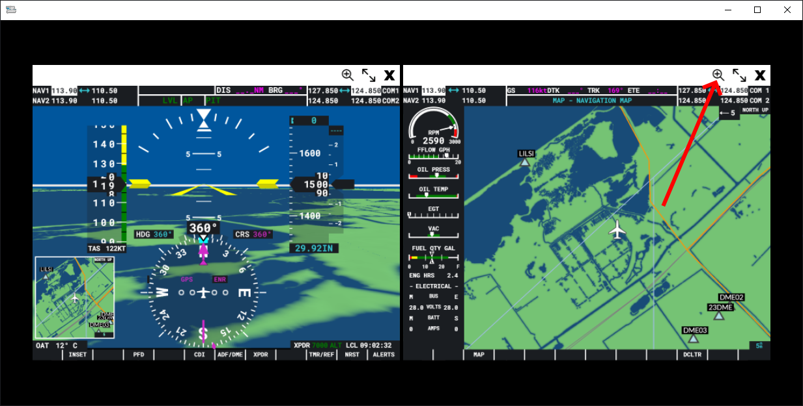
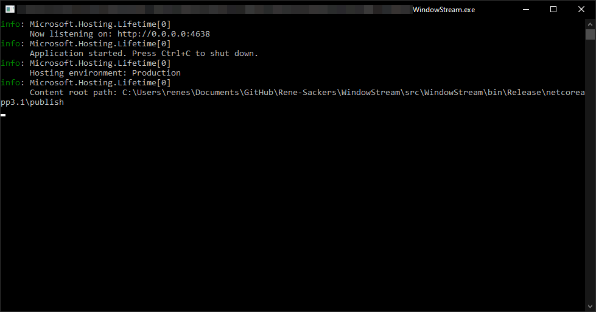
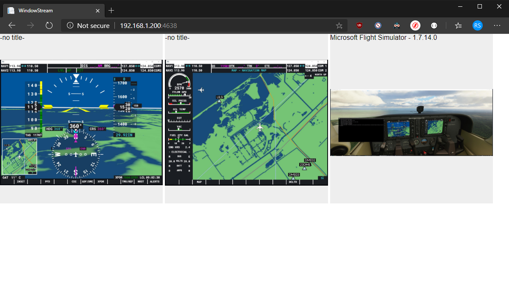
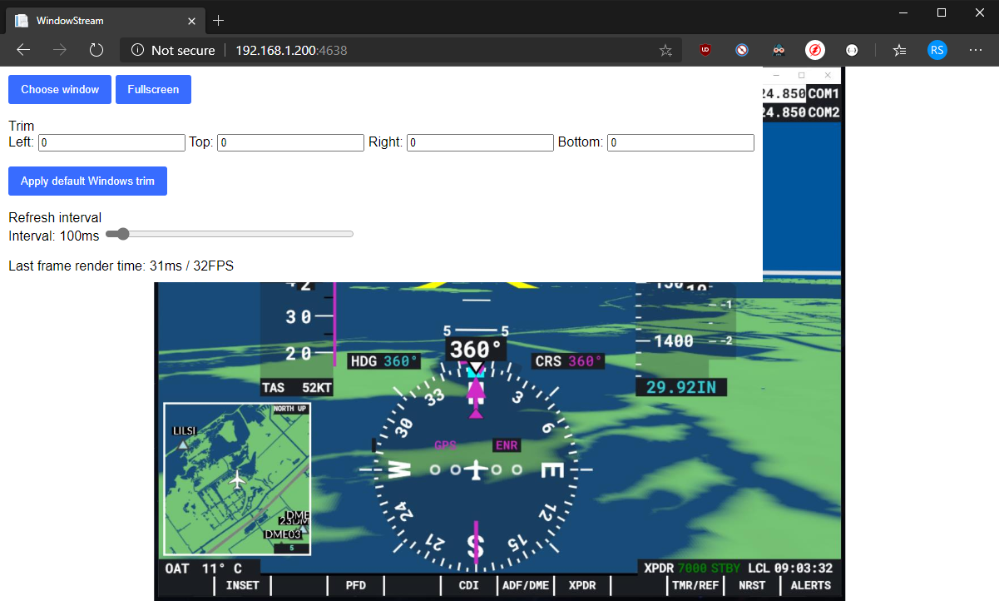

# Window Stream

## What is it?
This is a web application that runs on your PC that allows you to stream individual windows to any other device with a webbrowser.

I initially intended this for use with Microsoft Flight Simulator 2020, but you can stream any open window.

This application is something I threw together in a couple of hours. It's not extremely robust or pretty, but it works. See it as a temporary thing until someone creates something much nicer.

## A few warnings/limitations
There is **ZERO authentication** on this application and it currently listens to **ANY IP**. If someone is in your local network and they know your IP, then they can see your desktop. If you have for some reason forwarded the port the application is running on, or you have a DMZ network, anyone in the world with your public IP can see your desktop while the application is running.

This only works for windows that are visible. You can't stream a window behind another one, so you basically have to have a free monitor to put them on.

This doesn't use the most efficient way of streaming/capturing your screen. Therefore, it uses some CPU. You can increase or decrease the FPS on the streaming page. See configuration section below.

I haven't tested this on Safari (or an iPad/iPhone). I've tested on Chrome, Edge, Windows Phone Internet Explorer (don't ask), Chrome on Android and Edge on Android. 

## Installation
No installation, single .exe executable. Unzip & run.

### [Releases](https://github.com/Rene-Sackers/WindowStream/releases)

## Usage
For use with FS2020:
* Launch Microsoft Flight Simulator 2020
* Start your flight
* Hold the right-alt key and click any (digital) instrument you want to stream to a device  
	
* Separate the instruments into separate windows by clicking the magnifying glass in the newly created popup window  
	

To stream windows
* Launch WindowStream.exe
	
* Open the website in your browser. If you want to use a remote device, you need to find your local IP by opening CMD and running `ipconfig`. It's usually something along the lines of `192.168.1.167`  
Once you have your IP, enter the following address on the target device: http://{yourip}:4638/
* Select the window you want to stream on this device  
	
* Once you selected a window, it will start streaming that window to your browser, and you have a few options.  
	

## Configuration
To change the host port/IP, open `appsettings.json` and change it under `Kestrel.Endpoints.Http.url`

To go back to window selection, click `Choose window`  
To view the stream in full screen, clickc `Fullscreen`  
You can trim the window to remove any borders. There's also a button labeled `Apply default Windows trim`. This will trim 8 pixels left, right and bottom and 32 pixels from the top. This should remove the Windows 10 borders and just show the window content.  
There's a "Refresh interval" slider. This slider decides how many milliseconds to wait before rendering the next frame. Use this wisely, check the CPU usage and slide it to where you want. If you have an instrument that doesn't need fast updating, increase the slider.

Another way to majorly save on performance is by making the windows smaller.